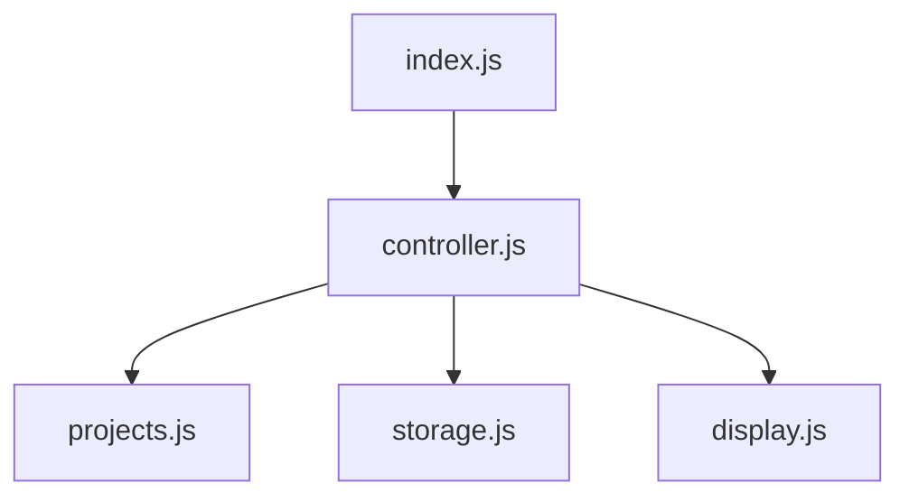

# todo_list
A Browser based todo list built as part of The Odin Project

Features:
  Create and select projects
  Add todos to a project (title, and whatever other fields you support)
  Mark a todo complete / incomplete
  Delete a todo
  View all todos across every project ("All Todos")
  Persistence through localStorage

For this project I wound up with a layout very similar to MVC, even though that wasn't the goal. My layout for dependencies is:

index.js
  - controller.js
    - projects.js
    - storage.js
    - display.js

The goal was to make dependency only go one direction 

That is to say: 

controller.js owns the decisions; display.js only draws what it's told and holds no state of its own.

I struggled with callback injection on this one. It got messy in the middle when I tried adding the todo delete and completion-toggle functionality to the All Todos display. Each action was manually deciding what to redraw, and they kept throwing errors. So I refactored everything around a single `renderCurrentView()` function.

The idea: every action changes the data, then calls `renderCurrentView()`. That function reads `activeProject` fresh each time (it holds either a project object or `null`) and picks the right display function — `updateTodos` for a single project, or `displayAllTodos` when nothing is active. No action has to remember what to redraw; it just changes data and hands off.

The callback injections (I'm not sure if this is the correct terminology) then works like this: functions defined in controller.js (`onTodoSubmit`, `selectAllTodos`, `onDeleteTodo`, `onToggleTodo`) get passed into display.js at render time and wired onto the buttons there. So display.js can invoke controller logic without ever importing from controller.js — which is what keeps the dependency arrow pointing one way.

For example: index.js runs `initDisplay(onTodoSubmit, selectAllTodos)`. When the All Todos button (built by display.js) is clicked, it runs `selectAllTodos` (defined in controller.js), which sets `activeProject` to `null` and calls `renderCurrentView()`. That sees no active project and calls `displayAllTodos`, passing in `onDeleteTodo` and `onToggleTodo` — which display.js attaches to each todo's delete button and completed checkbox as it renders them.

Overall this project took me about six days of fumbling confusion, punctuated by short bouts of understanding where and how to implement the next feature. I spent more time chasing bugs and figuring out errors than I did writing code. It was an incredible learning project and I'm very proud of how it turned out.